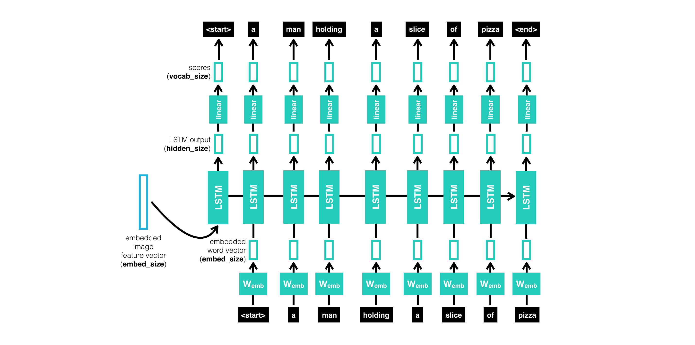
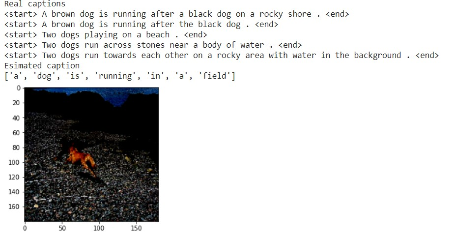

<h1 align="center">Image Captioning</h1>

## Introduction
This project aims to describe the content of an image by using CNNs and RNNs to build an Image Caption Generator. The model is based on a [paper](https://arxiv.org/pdf/1411.4555.pdf) and it is implemented using Tensorflow and Keras. The dataset used is [Flickr 8K](https://www.kaggle.com/adityajn105/flickr8k), consisting of 8,000 images each one paired with five different captions to provide clear descriptions. 

## Architecture
The model architecture consists of a CNN which extracts the features and encodes the input image and a Recurrent Neural Network (RNN) based on Long Short Term Memory (LSTM) layers. The most significant difference with other models is that the image embedding is provided as the first input to the RNN network and only once.

## Results
The following picture presents an example of a generated caption by the implemented model:

